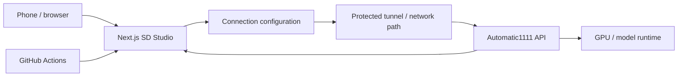

# SD Studio Web — Remote Stable Diffusion Control Surface

A Vercel-deployable, mobile-friendly web interface for controlling an **Automatic1111 Stable Diffusion API** from another device.

**Live demo:** https://sd-studio-web.vercel.app

[](https://github.com/wizelements/sd-studio-web/actions/workflows/ci.yml)
[](https://github.com/wizelements/sd-studio-web/actions/workflows/codeql.yml)

> **Status:** Retained technical asset. The public demo returned HTTP 200 on **October 7, 2026**. Automatic1111 is the implemented backend path. ComfyUI appears in type/metadata scaffolding but is **not yet implemented as a complete workflow** and is therefore not claimed as a working capability.

## Outcome

SD Studio separates the interaction surface from the GPU machine so a user can operate image generation from a phone, tablet, or remote browser while keeping the model runtime on their own backend.

Implemented product surfaces include:

- Automatic1111 server connection;
- text-to-image generation controls;
- mobile-first responsive UI;
- generation progress/state handling;
- gallery/history-oriented UI;
- dark interface;
- Vercel-deployable frontend;
- CI and CodeQL workflows.

## Architecture



## Current stack

| Layer | Technology |
| --- | --- |
| Framework | Next.js 14.2 |
| Language | TypeScript |
| UI | React 18 + Tailwind CSS |
| State | Zustand |
| Icons | Lucide React |
| Backend target | Automatic1111 API |
| Hosting | Vercel |
| Quality | GitHub Actions CI + CodeQL |

## Quick start

### Frontend

```bash
git clone https://github.com/wizelements/sd-studio-web.git
cd sd-studio-web
npm ci
cp .env.example .env.local
npm run dev
```

### Backend

Run Automatic1111 with its API enabled. Do **not** expose an unauthenticated Stable Diffusion API directly to the public internet.

Prefer one of these patterns:

- private network/VPN access;
- an authenticated reverse proxy;
- an access-controlled Cloudflare Tunnel;
- another authenticated tunnel/proxy that restricts who can reach the backend.

Avoid permissive wildcard CORS as a substitute for access control.

## Configuration

Use `.env.example` as the current configuration inventory.

A remote backend URL may be public from the browser's perspective, so treat the backend endpoint as a trust boundary. If an API key or proxy credential is used, verify whether it is safe to expose to client-side code before putting it in a `NEXT_PUBLIC_*` variable.

## Quality gates

```bash
npm ci
npm run lint
npm run type-check
npm run build
```

The CI workflow runs lint, type-check, and build on pushes/PRs. CodeQL is configured separately.

## Security

See [SECURITY.md](SECURITY.md).

The primary security risk is not the Vercel shell itself; it is exposing a GPU/model API too broadly. Protect the backend with real authentication/network controls and assume generation endpoints can consume meaningful compute.

## Current limitations

- **ComfyUI:** not yet implemented as a complete working backend workflow.
- **Image-to-image:** roadmap item.
- **ControlNet:** roadmap item.
- **Prompt templates/favorites:** roadmap item.
- This repository does not provision or secure the GPU backend for you.
- A live frontend does not prove that a user's private backend is reachable, authenticated, or healthy.

## Roadmap

- [ ] Complete and test ComfyUI workflow support
- [ ] Image-to-image generation
- [ ] ControlNet integration
- [ ] Prompt templates and favorites
- [ ] Add current product screenshot/GIF to the repository proof layer

## License

[MIT](LICENSE)

## Business / engineering value

SD Studio demonstrates a reusable pattern for **remote control of local or private AI infrastructure**: a lightweight public/user-facing surface can remain separate from the expensive compute node, provided routing and authorization are handled deliberately.

---

**Cod3Black Agency / wizelements**  
**Last portfolio verification:** October 7, 2026
